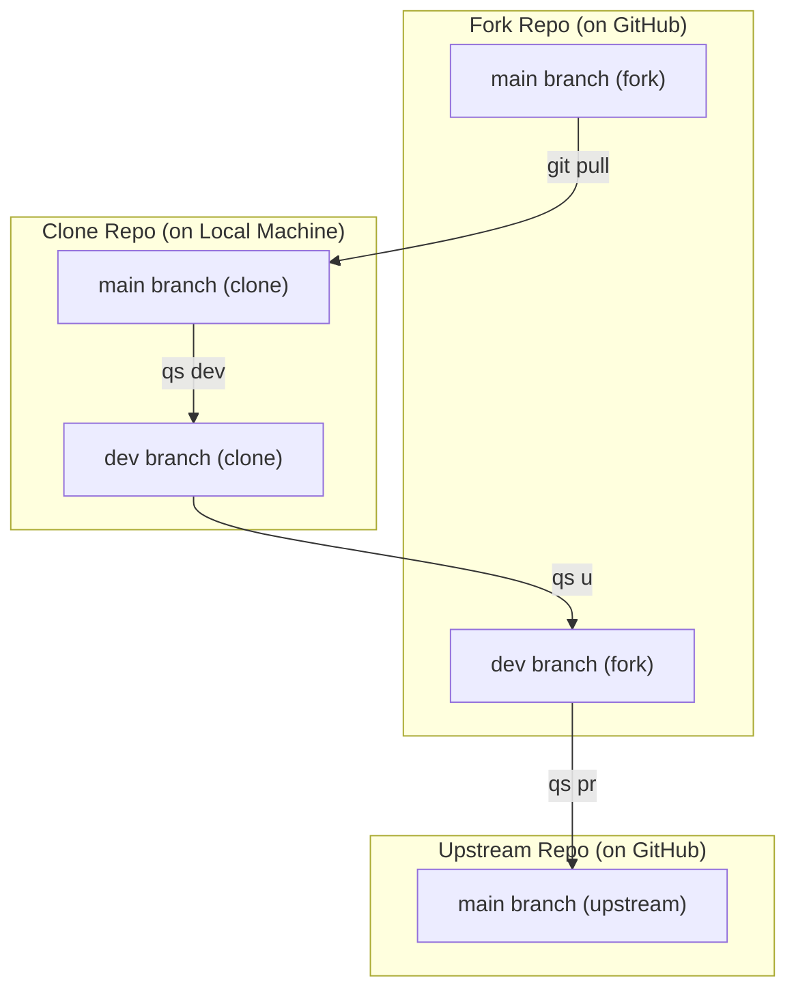

# Design of the system tests for the `qs` utility

## Introduction

System tests are designed to validate the functionality of the `qs` utility, to ensure that the utility behaves as expected in different situations.

## Motivation

The motivation behind these system tests is to ensure that the `qs` utility works correctly in a real-world scenario, where it interacts with remote repositories on GitHub. The tests will cover various aspects of the utility, including forking repositories, creating branches, making commits, and creating pull requests.

## Definitions:
- **Upstream repo**: the original GitHub repository (often the main project you forked from)
- **Fork repo**: it is your copy of the upstream repo under your GitHub account
- **Clone repo**: it is your local copy on your computer cloned from your fork (or sometimes upstream)
- **GH account**: it is a Github-account used for testing. It will be provided with a token that has access to the forked remote repository
- **Upstream**: it is remote repository mentioned in clone repo. Leads to upstream repo
- **Origin**: it is remote repository mentioned in clone repo. Leads to fork repo
- **Test framework**: it is a set of scripts and methods used to run system tests. It will be responsible for creating and deleting test repos, running the `qs` utility, and checking the results
- **Test environment**: it is a set of upstream repo, fork repo, clone repo, values of upstream and origin
- **System test**: it is a test written in Go language, which will be executed by test framework. It will use the `qs` utility to perform various operations on the test environment and check the results

### Branch flow:



## Principles
- The framework must check prerequisites: existence of `qs` utility, `gh` utility, and `git` utility;
- The framework must create the environment according to passed parameters
- A content of the upstream repo must be the same for all tests. It will be provided in the `./internal/testdata/repo` directory
- There is a `go.mod.tmpl` file in the upstream repo. It will be used for creating `go.mod` file in the upstream repo. The framework must replace fields `GhAccount` and `UUID` in the `go.mod.tmpl` file to form unique package name for the upstream repo. The `GhAccount` field will be replaced with the name of the Github account used for testing, and the `UUID` field will be replaced with a unique UUID v4 value
- `go.mod.tmpl` must be in `.gitignore` file of the upstream repo
- The clone repo must be created in `./.testdata` directory with unique name. UUID v4 will be used for this purpose
- The test framework itself is must be located in `./internal/systrun` 
- System tests must be located in `./sys_test.go`
- If the tess succeed, the framework must delete repos: upstream, fork and clone. Otherwise, the framework must leave them for debugging purposes
- Access to the GH account must be provided via environment variables: token, account name, organization name. Environment variables for them: `GH_TOKEN`, `GH_ACCOUNT`,`GH_ORG`
- The framework must check stdout, stderr for the content mentioned in test. The framework must be able to make additional checks using provided custom function

## Test cases
**1. Main test cases**:
- Creating a forked remote repository in the GH account
- An installation of the `qs` utility and checking out prerequisites (dependencies)
- Creating a fork of the remote repo
- Creating a developer branch in fork repo
- Several sequential commits in fork repo
- Pushing to upstream repository some changes and the actualization of the developer branch up to the main branch
- Creating a pull request. PR must contain only one squashed commit instead of several commits
- The framework must be able to extract origin, upstream from clone repo and check whether they exist or not
- Deleting the developer branch in the fork repo
- Deleting the fork repo

**2. Edge test cases**:
- No environment variables. Missing some environment variables related to remote repo, Github-token, etc
- Branch mismatch: Check for errors when trying to create a dev branch while on a non-main branch
- Push with stash: Verify stashed changes are handled properly before switching to or creating a new branch
- Empty notes: Validate that commit creation still works when no comments are included
- Large files: Confirm the pre-commit hook triggers when a staged file exceeds size restrictions

**3. Testing Infrastructure**:<br/>
There must be `.internal/testdata` directory with the following structure:
```remote-repo
├── main.go
├── main_test.go
└── go.mod.tmpl
```

## Implementation
1. The framework must return SystemTest object
2. SystemTest object must have the following methods:
   - `AddCase()`
   - `Run()`

## File structure:
```./internal/systrun/provide.go
package systrun

func NewSystemTest(t *testing.T, cfg SystemTestCfg) ISystemTest {
	return &SystemTest{
		t:   t,
		cfg: cfg,
	}
}
```

```./internal/systrun/interface.go

type ISystemTest interface {
	AddCase(tc TestCase)
	Run() error
}
```

```./internal/systrun/types.go
package systrun

import (

	"github.com/untillpro/goutils/exec"
)

type SystemTestCfg struct {
	GhAccount     string
	GhToken       string
	GhOrg         string
	upstreamRepoName  string
	ForkRepoName  string
	CloneRepoPath string
}

type SystemTest struct {
	t     *testing.T
	cfg   SystemTestCfg
	cases []TestCase
}
type TestCase struct {
	Name         string
	Stderr       string
	Stdout       string
	Cmd          string
	Args         []string
	CheckResults func(t *testing.T)
}
```

```./internal/systrun/impl.go
func (st *SystemTest) createForkRepo() error {
    // Create fork repo
}

func (st *SystemTest) createCloneRepo() error {
    // Create clone repo
}

func (st *SystemTest) createupstreamRepo() error {
    // Create upstream repo
}

func (st *SystemTest) createEnv() error {
    // Create environment based on cfg
}

func (st *SystemTest) deleteEnv() error {
    // Delete environment in case of success
}

func (st *SystemTest) AddCase(tc TestCase) error {
    cases = append(cases, tc)
}

func (st *SystemTest) runCommand(command string, ...args string) string, string, error {
	cmd := exec.Command(command, args...)
	cmd.Dir = st.CloneRepoPath

	// Capture stdout and stderr
	stdout := &strings.Builder{}
	stderr := &strings.Builder{}
	cmd.Stdout = stdout
	cmd.Stderr = stderr

	err := cmd.Run()

	return stdout.String(), stderr.String(), err
}

func (st *SystemTest) Run() error {
    if err := st.createEnv(); err != nil {
        return err
    }

    for _, tc := range cases {
        stdout, stderr, err := st.runCommand(tc.Cmd, tc.Args...)
        if err != nil {
            st.t.Logf("Error: %v", err)
         
            return err
        }
        
        if len(tc.Stdout)>0 && stdout != tc.Stdout {
            st.t.Logf("Expected stdout: %s, got: %s", tc.Stdout, stdout)
         
            return fmt.Errorf("stdout mismatch")
        }
        
        if stderr != tc.Stderr {
            st.t.Logf("Expected stderr: %s, got: %s", tc.Stderr, stderr)
         
            return fmt.Errorf("stderr mismatch")
        }
        
        if err := tc.CheckResults(st.t); err != nil {
			st.t.Logf("Error: %v", err)

            return err
        }
    }
    
    err := st.deleteEnv()
    if err != nil
        st.t.Logf("Error: %v", err)
    }
    
    return err
}
```